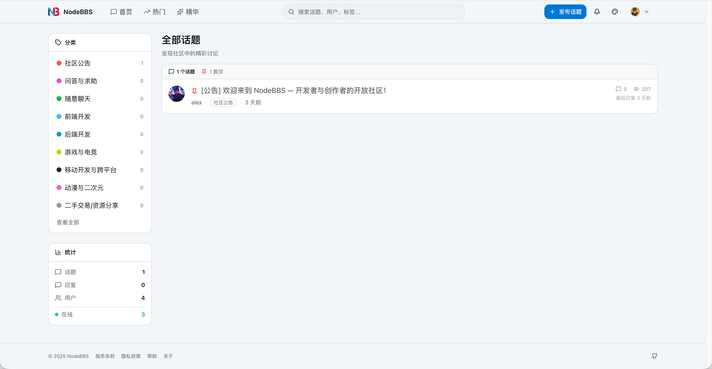
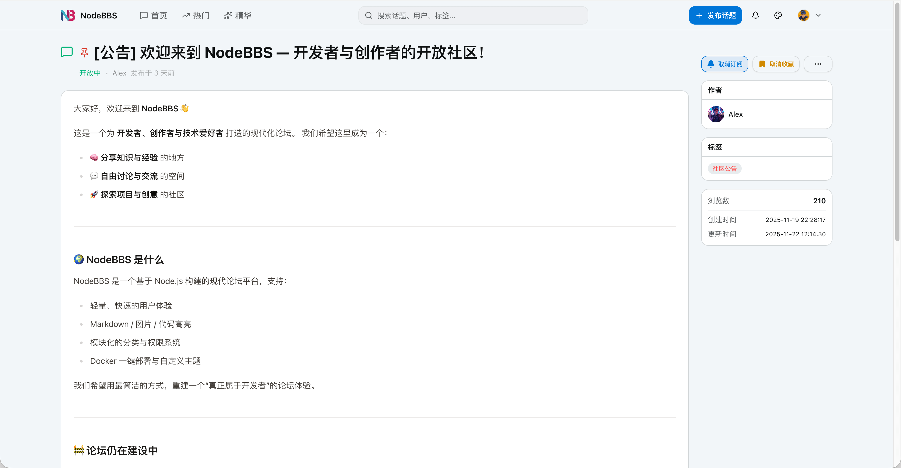
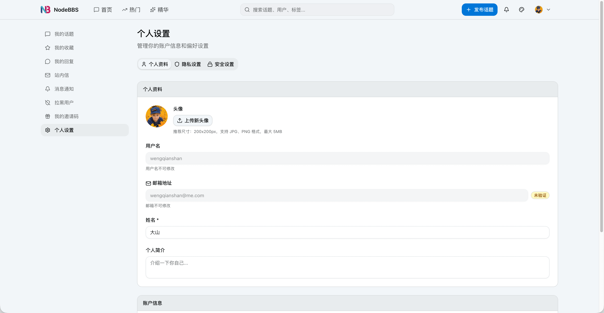
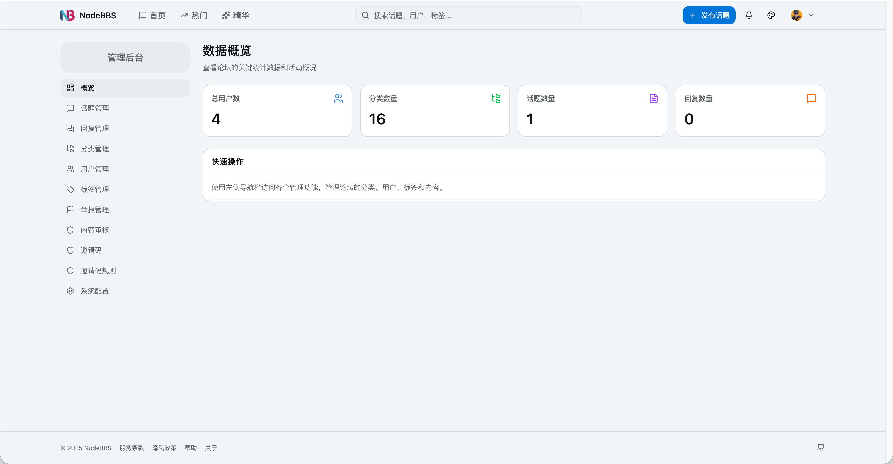
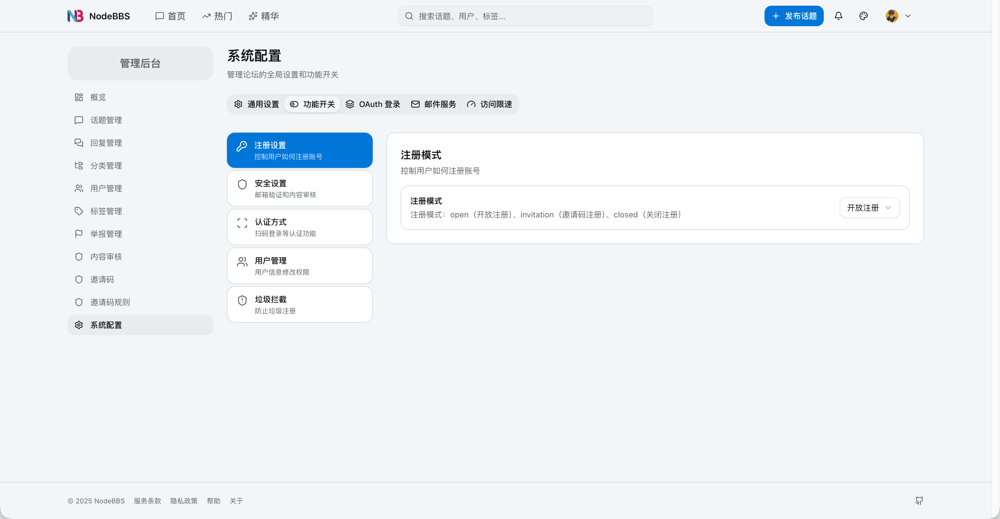
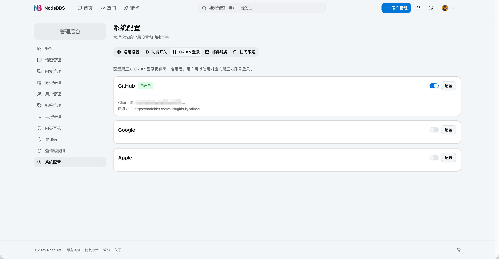

# NodeBBS

一个基于 Turborepo 单体仓库架构构建的现代化、高性能论坛平台。

简体中文 | [English](./README.en.md)

## 🏗️ 系统架构

| 服务 | 技术 | 端口 | 说明 |
|------|------|------|------|
| **web** | Next.js 16 | 3100 | 前端应用 |
| **api** | Fastify | 7100 | 后端 API 服务 |
| **postgres** | PostgreSQL 16 | 5432 | 主数据库 |
| **redis** | Redis 7 | 6379 | 缓存服务 |


## 🚀 快速开始

### 前置要求

- **Docker**: Docker Engine 20.10+
- **Docker Compose**: 2.0+
- **Node.js**: 22+


### 部署

NodeBBS 提供**交互式 CLI 部署工具**，支持源码部署和镜像部署两种方式，任选其一即可。

#### 方式一：源码部署（直接使用最新源码）

```bash
git clone https://github.com/aiprojecthub/nodebbs.git
cd nodebbs
npx nodebbs
```

#### 方式二：镜像部署（快速启动）

```bash
mkdir nodebbs && cd nodebbs
npx nodebbs
```

### ℹ️ 说明

* `nodebbs cli` 是一个 **交互式部署工具**，会引导你完成全部初始化配置
* 使用前请确保已安装 CLI 工具：

```bash
npm install -g nodebbs
# 或直接使用
npx nodebbs
```

* CLI 详细说明与参数文档：
  👉 [https://www.npmjs.com/nodebbs](https://www.npmjs.com/nodebbs)

## ✨ 功能预览

### 前台界面

<table>
  <tr>
    <td width="50%">
      
      <p align="center"><b>论坛首页</b> - 话题列表、分类导航</p>
    </td>
    <td width="50%">
      
      <p align="center"><b>话题详情</b> - Markdown 支持、评论互动</p>
    </td>
  </tr>
  <tr>
    <td width="50%">
      
      <p align="center"><b>个人设置</b> - 资料编辑、头像上传</p>
    </td>
    <td width="50%">
      
      <p align="center"><b>管理后台</b> - 数据统计、内容管理</p>
    </td>
  </tr>
</table>

### 管理后台

<table>
  <tr>
    <td width="50%">
      
      <p align="center"><b>注册设置</b> - 注册模式配置</p>
    </td>
    <td width="50%">
      
      <p align="center"><b>OAuth 登录</b> - 第三方登录集成</p>
    </td>
  </tr>
</table>

## 📋 技术栈

### 后端 (API)
- **框架**: [Fastify](https://fastify.dev/) - 高性能 Node.js Web 框架
- **数据库**: PostgreSQL 16 + [Drizzle ORM](https://orm.drizzle.team/)
- **身份验证**: JWT + OAuth2
- **缓存**: Redis 7
- **邮件服务**: Nodemailer
- **API 文档**: Swagger/OpenAPI
- **进程管理**: PM2

### 前端 (Web)
- **框架**: [Next.js 16](https://nextjs.org/) (支持 Turbopack)
- **UI 库**: React 19
- **样式**: Tailwind CSS 4
- **组件库**: Radix UI
- **表单处理**: React Hook Form
- **Markdown**: React Markdown (支持 GitHub 风格)
- **主题**: next-themes (支持深色/浅色模式)

### 开发与部署
- **单体仓库**: Turborepo
- **包管理器**: pnpm 10+
- **环境变量**: dotenvx
- **容器化**: Docker + Docker Compose
- **反向代理**: Nginx (生产环境)

## 🛠️ 开发环境设置（不使用 Docker）

### 前置要求
- Node.js >= 22
- pnpm >= 10.0.0
- PostgreSQL
- Redis

### 步骤

```bash
# 1. 安装依赖
pnpm install

# 2. 配置环境变量
cd apps/api && cp .env.example .env
cd ../web && cp .env.example .env

# 3. 设置数据库
cd ../api
pnpm db:push
pnpm seed

# 4. 启动开发服务器
cd ../..
pnpm dev

# API: 7100 端口 | Web: 3100 端口
```

## 🤝 贡献

欢迎贡献！请遵循以下步骤：

1. Fork 本仓库
2. 创建你的特性分支 (`git checkout -b feature/amazing-feature`)
3. 提交你的更改 (`git commit -m 'Add amazing feature'`)
4. 推送到分支 (`git push origin feature/amazing-feature`)
5. 打开一个 Pull Request

## 📄 许可证

MIT

## 🐛 支持

如有问题：
- 在 GitHub 上提交 issue

